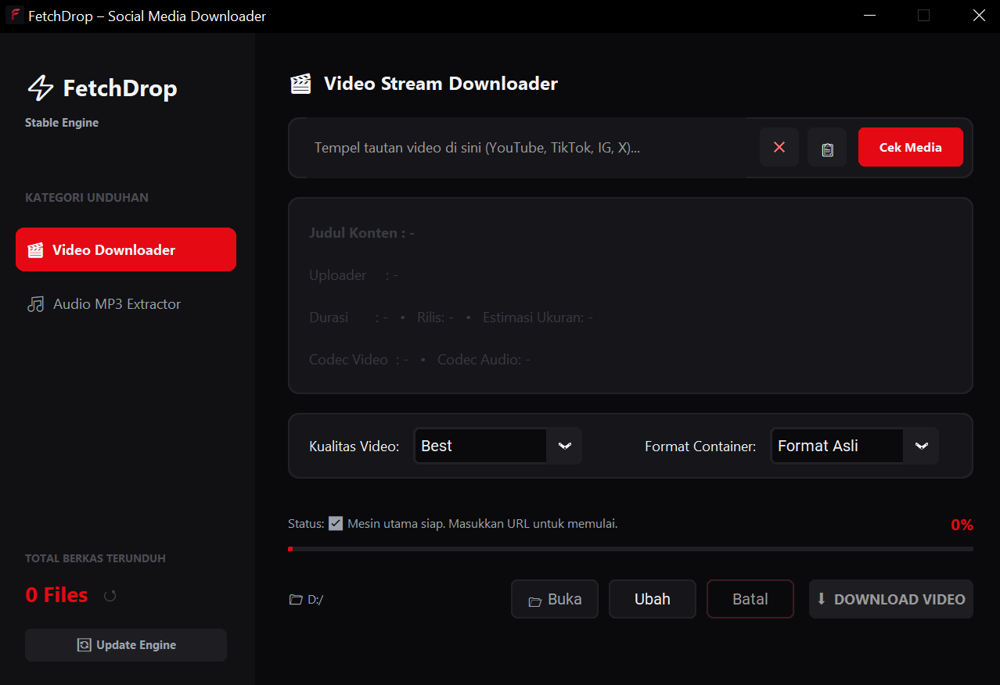

<div align="center">


# ⚡ FetchDrop
### Universal Media Downloader — Video & Audio Extractor

[](https://www.python.org/)
[](https://github.com/TomSchimansky/CustomTkinter)
[](https://www.microsoft.com/windows)
[](LICENSE)
[](https://github.com/yt-dlp/yt-dlp)

**FetchDrop** adalah aplikasi pengunduh media universal dengan antarmuka grafis modern. Dibangun menggunakan Python dan CustomTkinter, dengan arsitektur *Decoupled Engine* yang ringan dan efisien.

</div>

---

## 🖥️ Preview Tampilan



> *Antarmuka Video Downloader dengan tema gelap (Dark Mode) yang bersih dan modern.*

---

## ✨ Fitur Utama

| Fitur | Deskripsi |
|-------|-----------|
| 🔌 **Decoupled Engine** | Mesin inti (`yt-dlp.exe` + `ffmpeg`) tidak di-*bundle* ke `.exe`, diunduh otomatis ke `~/.fetchdrop_engine` saat *first run* — ukuran aplikasi tetap ringan |
| 🎬 **Multi-Platform** | Mendukung YouTube (Video, Shorts, Playlist, Music), TikTok, Instagram (Reels, Post, TV), dan X / Twitter |
| 🎵 **MP3 Extractor Pintar** | Konversi video ke MP3 murni dengan *Constant Bitrate* (CBR) hingga 320 kbps, lengkap dengan metadata dan cover art |
| 🎯 **Resolusi Cerdas** | Filter Anti-Storyboard yang memilih resolusi asli (hingga 4K) dan mengabaikan format thumbnail/storyboard palsu |
| ⚡ **UI Asinkronus & Animasi** | Antarmuka tidak pernah *freeze* berkat implementasi `threading` penuh; dilengkapi animasi *color sweep* pada sidebar, *smooth progress bar* dengan easing, dan efek *fade-in* bertahap pada info media |
| 🔔 **Toast Notification** | Notifikasi *native* Windows (PowerShell WinRT) muncul otomatis saat unduhan selesai; menggunakan skrip Base64-encoded agar kebal terhadap karakter spesial pada judul video |
| 📋 **Auto Clipboard Detection** | Saat jendela mendapat fokus, FetchDrop otomatis mendeteksi URL valid di *clipboard* dan langsung memuat info medianya — tanpa perlu tempel manual |
| 🕓 **Riwayat Unduhan** | Panel riwayat lengkap mencatat platform, kualitas, ukuran, dan waktu unduhan; setiap entri dapat diklik untuk langsung membuka folder tujuan |
| 📊 **Download Counter** | Penghitung jumlah berkas yang berhasil diunduh tersimpan permanen di konfigurasi, dilengkapi tombol reset |
| 💾 **Persistent Config** | Pengaturan terakhir (folder tujuan, kualitas, format container, mode sidebar) otomatis disimpan dan dimuat kembali saat aplikasi dibuka ulang |
| 🔒 **Single Instance Lock** | Mencegah lebih dari satu proses FetchDrop berjalan sekaligus menggunakan *file-lock* Windows (`msvcrt`); jika aplikasi sudah aktif, dialog peringatan muncul tanpa membuka jendela baru |
| 🛡️ **Error Handling** | Penghentian proses bersih (*graceful shutdown*) via `taskkill`, deteksi kode error spesifik yt-dlp (privat/dihapus, URL tidak valid, dll.), pembersihan file parsial dengan *exponential backoff retry*, serta pencatatan log via `RotatingFileHandler` (256 KB, 2 file backup) |

---

## 🌐 Platform yang Didukung

<div align="center">

|  | Platform | Format |
|--|----------|--------|
| 📺 | **YouTube** | Video, Shorts, Playlist, Music |
| 🎵 | **TikTok** | Video, Slideshow |
| 📸 | **Instagram** | Reels, Post, TV |
| 🐦 | **X / Twitter** | Video, GIF |

</div>

---

## 🛠️ Prasyarat (Untuk Developer)

Sebelum menjalankan atau melakukan *build* dari *source code*, pastikan sistem Anda memiliki:

- **Python 3.10** atau lebih baru
- **OS Windows 10 / 11**
- **Nuitka** dan **C compiler** (MinGW-w64 atau MSVC) — diperlukan untuk proses kompilasi
- **Koneksi internet** (untuk unduh mesin otomatis saat pertama kali dijalankan)

### Dependencies

Instal semua library yang dibutuhkan menggunakan `requirements.txt`:

```
customtkinter
Pillow
darkdetect
zstandard
ordered-set
nuitka
```

```bash
pip install -r requirements.txt
```

> **Catatan:** `Pillow` dan `darkdetect` merupakan dependensi tidak langsung dari `customtkinter`. `zstandard` digunakan oleh Nuitka untuk kompresi *onefile* — tanpa ini, proses build akan gagal atau menghasilkan file yang lebih besar. `ordered-set` mempercepat proses kompilasi Nuitka secara signifikan. Mencantumkan semuanya secara eksplisit memastikan versi yang kompatibel selalu terpasang.

---

## 🚀 Instalasi & Build

### Langkah 1 — Clone Repositori

```bash
git clone https://github.com/USERNAME_ANDA/FetchDrop.git
cd FetchDrop
```

### Langkah 2 — Siapkan Virtual Environment & Instal Dependensi

> Disarankan menggunakan *Virtual Environment* yang bersih agar lingkungan pengembangan tetap terisolasi.

```bash
python -m venv env
env\Scripts\activate
pip install -r requirements.txt
```

### Langkah 3 — Build ke `.exe` menggunakan Nuitka

Jalankan perintah berikut untuk mengompilasi aplikasi menjadi satu file eksekutabel:

```bash
python -m nuitka --clean-cache=all --standalone --onefile --windows-console-mode=disable --windows-icon-from-ico=icon.ico --include-data-files=icon.ico=icon.ico --enable-plugin=tk-inter --include-package=customtkinter --company-name="FetchDrop" --product-name="FetchDrop" --product-version="1.0.0.0" --file-description="FetchDrop - Social Media Downloader" --copyright="FetchDrop" --output-filename=FetchDrop.exe --assume-yes-for-downloads fetchdrop.py
```

**Penjelasan flag utama:**

| Flag | Fungsi |
|------|--------|
| `--clean-cache=all` | Membersihkan seluruh cache Nuitka sebelum build dimulai — memastikan output yang bersih tanpa artefak sisa dari build sebelumnya |
| `--standalone` | Sertakan semua dependensi Python ke dalam output |
| `--onefile` | Kompres hasil *standalone* menjadi satu file `.exe` tunggal |
| `--windows-console-mode=disable` | Sembunyikan jendela Command Prompt (setara `--noconsole` di PyInstaller) |
| `--windows-icon-from-ico=icon.ico` | Pasang ikon pada file `.exe` yang dihasilkan |
| `--include-data-files=icon.ico=icon.ico` | Sertakan file ikon ke dalam bundle agar dapat dibaca saat runtime |
| `--enable-plugin=tk-inter` | Aktifkan plugin Nuitka untuk Tkinter / CustomTkinter |
| `--include-package=customtkinter` | Pastikan seluruh modul CustomTkinter ikut ter-*bundle* (termasuk import dinamis) |
| `--company-name="FetchDrop"` | Mengisi metadata *Company Name* pada file `.exe` (terlihat di *Properties → Details*) |
| `--product-name="FetchDrop"` | Mengisi metadata *Product Name* pada file `.exe` |
| `--product-version="1.0.0.0"` | Mengisi versi produk dalam format Windows empat segmen (`x.x.x.x`) pada metadata `.exe` |
| `--file-description="..."` | Deskripsi file yang tampil di Windows Explorer dan Task Manager |
| `--copyright="FetchDrop"` | Informasi hak cipta (*Copyright*) pada metadata file `.exe` |
| `--output-filename=FetchDrop.exe` | Tentukan nama file output secara eksplisit |
| `--assume-yes-for-downloads` | Izinkan Nuitka mengunduh komponen yang dibutuhkan (misal GCC) secara otomatis |

> **📁 Output:** File hasil *build* akan berada di direktori yang sama dengan nama `FetchDrop.exe`.

> **💡 Tips:** Pada *build* pertama, Nuitka akan mengunduh MinGW-w64 secara otomatis jika belum tersedia di sistem. Proses ini hanya terjadi sekali. Flag `--clean-cache=all` memang memperlambat build, namun sangat dianjurkan saat ada perubahan signifikan pada kode atau environment.

---

## 💡 Cara Penggunaan

```
1. Buka FetchDrop.exe
   └── Saat pertama kali, aplikasi otomatis mengunduh mesin (yt-dlp + ffmpeg)

2. Pilih mode di sidebar kiri
   ├── 🎬 Video Downloader
   ├── 🎵 Audio MP3 Extractor
   └── 🕓 Riwayat Unduhan

3. Tempel (paste) URL video di kolom input
   └── Atau biarkan FetchDrop mendeteksi otomatis — jika URL valid ada di clipboard
       saat jendela mendapat fokus, info media akan langsung dimuat

4. Tunggu analisis selesai
   └── Judul, uploader, durasi, tanggal rilis, codec, dan estimasi ukuran akan tampil

5. Sesuaikan pengaturan
   ├── Mode Video : Kualitas Video (Best / 4K / 1080p / dll) + Format Container (MP4 / MKV / Format Asli)
   └── Mode Audio : Bitrate MP3 (320 kbps / 192 kbps / 128 kbps)

6. Klik [DOWNLOAD VIDEO] atau [EKSTRAK MP3]
   └── File otomatis tersimpan di folder Downloads (atau folder yang dipilih)
   └── Notifikasi Windows muncul otomatis saat unduhan berhasil

7. Lihat riwayat di panel Riwayat Unduhan
   └── Klik entri untuk membuka folder tujuan langsung dari aplikasi
```

---

## 🗂️ Struktur Proyek

```
FetchDrop/
├── fetchdrop.py        # Source code utama
├── icon.ico            # Ikon aplikasi
├── requirements.txt    # Daftar dependensi Python
├── build_nuitka.bat    # Script build otomatis (Windows)
├── preview.PNG         # Screenshot tampilan GUI
├── LICENSE             # Lisensi MIT
└── README.md           # Dokumentasi ini
```

---

## ❓ FAQ

**Q: Apakah saya perlu menginstal yt-dlp atau ffmpeg secara manual?**
> Tidak. FetchDrop akan mengunduh dan mengonfigurasi kedua mesin ini secara otomatis ke folder `~/.fetchdrop_engine` saat pertama kali dijalankan.

**Q: Mengapa build dengan Nuitka lebih baik dari PyInstaller?**
> Nuitka mengompilasi Python ke kode C terlebih dahulu sebelum dikompilasi menjadi *native binary*. Hasilnya adalah eksekutabel yang lebih cepat, lebih kecil, dan secara signifikan mengurangi *false positive* dari antivirus dibanding pendekatan bundling PyInstaller. Flag metadata (`--company-name`, `--product-name`, dll.) juga membuat file terlihat lebih legitim di mata Windows Defender.

**Q: Windows Defender memblokir aplikasi. Apa yang harus dilakukan?**
> Meskipun Nuitka jauh lebih jarang memicu *false positive*, hal ini kadang masih bisa terjadi. Tambahkan `FetchDrop.exe` ke *exclusion list* Windows Defender, atau jalankan langsung dari *source code*.

**Q: Mengapa unduhan gagal pada beberapa video?**
> Kemungkinan mesin `yt-dlp` sudah kedaluwarsa. Klik tombol **Update Engine** di sidebar kiri untuk memperbarui ke versi terbaru.

**Q: Di mana file hasil unduhan tersimpan?**
> Secara default di folder `Downloads` sistem Anda. Lokasi ini bisa diubah melalui tombol **Ubah Folder** di bagian bawah aplikasi. Perubahan disimpan permanen ke konfigurasi.

**Q: Bagaimana cara melihat riwayat unduhan?**
> Klik menu **🕓 Riwayat Unduhan** di sidebar kiri. Setiap entri mencatat judul, platform, kualitas, ukuran, dan waktu unduhan. Klik salah satu entri untuk membuka folder tujuannya langsung di File Explorer.

**Q: Fitur auto-clipboard itu bekerja seperti apa?**
> Setiap kali jendela FetchDrop mendapat fokus (misalnya setelah Anda menyalin URL dari browser), aplikasi akan otomatis mengecek isi clipboard. Jika ditemukan URL dari platform yang didukung dan belum ada di kolom input, URL tersebut langsung diisi dan analisis media dimulai.

**Q: Apakah bisa menjalankan FetchDrop lebih dari satu jendela sekaligus?**
> Tidak. FetchDrop menggunakan *single instance lock* — jika aplikasi sudah berjalan di latar belakang, mencoba membuka instance kedua akan memunculkan dialog peringatan dan proses baru langsung ditutup.

---

## 📜 Lisensi

Proyek ini didistribusikan di bawah **MIT License**.
Lihat file [`LICENSE`](LICENSE) untuk informasi lengkap.

---

<div align="center">

Dibuat dengan ❤️ menggunakan Python & CustomTkinter

⭐ Jika proyek ini bermanfaat, jangan lupa beri bintang di GitHub!

</div>
